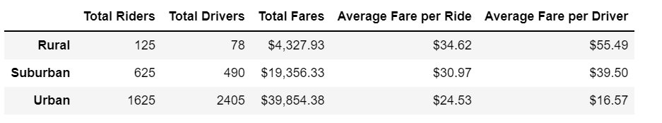

# PyBer_Anaysis
## Overview of the analysis
We are to collect, condence, and calculate the weekly fares for each city type. We will use this information to find differences between city types. 

## Results
There is a major difference between the city types. The rural makes up 4.6% of the combined riders and drivers. The suburban makes up 25.6% of the combined riders and drivers. The Urban makes up 69.7% of the combined riders and drivers. This correlates with the urban city area making the most money of around $40,000 dollars. The best fare per ride was in the urban area and best average fare per driver was in the rural area. With how the population is spread out between the 3 areas, these results are accurate. 
 
 
## Summary: Based on the results, provide three business recommendations to the CEO for addressing any disparities among the city types.
Some business recommendations would be:
1. The high volume of urban drivers is bringing down the average fare per driver. It would be a good idea to remove a portion of the drivers or try and move them to the suburban or rural areas.
2. The suburban and rural areas are a very small portion. Would need to push more infrustructure so more people would move out of the urban area.
3. Give drivers higher rates for driving into different areas for riders. 
